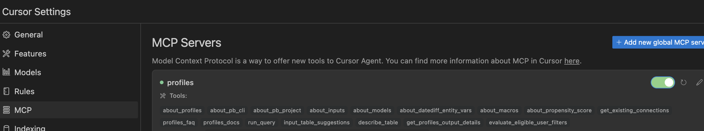

# Profiles MCP Server

## What is This?

The Profiles MCP Server enables you to build RudderStack Profiles projects using natural language through AI assistants. Simply describe what you want to accomplish, and the AI will guide you through data discovery, identity resolution, feature engineering, and propensity modeling - all through conversational interactions.

## Prerequisites

- **Python 3.10.x** installed on your system
- **Data Warehouse Access** with appropriate permissions:
  - **Snowflake**: Read access to input tables and write access to output schema
  - **BigQuery**: Read access to input datasets and write access to output dataset
  - **Databricks**: SQL warehouse or cluster access with read/write permissions
  - **Redshift**: Cluster or Serverless access with read/write permissions
- **RudderStack Personal Access Token**: Generate one from your [RudderStack dashboard](https://www.rudderstack.com/docs/dashboard-guides/personal-access-token/#generate-personal-access-token)
- **AI Client with MCP Support**: See [AI Client Support](#ai-client-support) section below

### Authentication Requirements

- **Snowflake**: MFA (Multi-Factor Authentication) is not supported. If your account has MFA enabled, use [key-pair authentication](https://docs.snowflake.com/en/user-guide/key-pair-auth) instead
- **BigQuery**: Supports Service Account JSON files and Application Default Credentials
- **Databricks**: Supports Personal Access Token (PAT) and M2M OAuth authentication
- **Redshift**: Supports Username/Password and IAM Role (with AWS Secrets Manager)

## AI Client Support

The Profiles MCP server works with any AI client that supports the Model Context Protocol (MCP).

### Automatic Integration

Running the setup script (`./setup.sh`) will automatically:
1. Create the MCP server startup script (`scripts/start.sh`)
2. Configure MCP integration for supported AI clients:
   - **Cursor IDE**
   - **Claude Code** (claude.ai/code)
   - **Cline** (VSCode extension)

If the automatic integration doesn't work or you encounter issues, you can manually configure the integration (see below).

### Manual Integration

For other AI clients or if automatic integration fails:

1. **First, run setup**: Ensure you've run `./setup.sh` to create the `scripts/start.sh` file and install dependencies

2. **Configure your AI client's MCP settings** to point to:
   ```
   /absolute/path/to/profiles-mcp/scripts/start.sh
   ```
   Replace `/absolute/path/to/profiles-mcp/` with the actual full path to your cloned repository

3. Refer to your specific AI client's documentation for MCP server configuration. Make sure you update the client to its latest version

4. Restart your AI client after configuration

**Recommended Model**: For the best experience, we recommend using **high-capability models** such as the latest Claude Sonnet, GPT-5 class, or similar advanced reasoning models. While the server works with most LLMs, advanced reasoning models provide optimal performance for complex profiles project workflows

## Quick Start

1. Clone this repository and navigate to the directory:
   ```bash
   cd profiles-mcp
   ```

2. Run the setup script:
   ```bash
   ./setup.sh
   ```

   This will:
   - Check for Python 3.10.x and `uv` package manager
   - Install `uv` if not found
   - Create `.env` file if missing
   - Install all dependencies
   - Download and extract embeddings to `src/data/`
   - Automatically configure MCP integration for supported AI clients (Cursor, Claude Code, Cline)

3. Restart your AI client to apply the configuration changes

## Usage

Once configured, you can interact with the AI using natural language to build profiles projects. The AI will guide you through the entire process. If you have multiple MCP servers running, or you are working in a blank project, the AI may need to be prompted to use Rudderstack Profiles, so it knows to call the Profiles MCP server.

### Example prompts to start a conversation

**Predictive Analytics:**
```
"Build a churn prediction model for my subscription users in Snowflake using Rudderstack Profiles"
"Add a customer lifetime value prediction model to my profiles project"
```

**Feature Engineering:**
```
"Build a customer profiles project with purchase behavior features"
"Generate features for my marketing campaigns using Rudderstack Profiles"
```

**Identity Resolution:**
```
"Stitch together user identities across email, phone, and user_id, using Rudderstack Profiles"
"Create unified customer profiles from multiple data sources"
```

The AI will:
1. Discover relevant tables in your warehouse
2. Guide you through configuration decisions
3. Generate the necessary YAML files
4. Validate your setup
5. Help you run and troubleshoot the project

## Troubleshooting

### Verifying MCP Server Status

**For Cursor Users:**
In Cursor MCP settings, you should see the profiles mcp tool active with a green indicator. See the reference image:


**For All AI Clients:**
If the MCP tools are not available or the server appears inactive:

1. Test the server directly by running in your terminal:
   ```bash
   cd profiles-mcp
   ./scripts/start.sh
   ```

2. Check for errors in the output or review the log file:
   ```bash
   cat profiles-mcp.log
   ```

3. Common issues:
   - **Python version**: Ensure Python 3.10.x is installed and in your PATH
   - **Missing dependencies**: Re-run `./setup.sh`
   - **Environment variables**: Verify `.env` file exists with your RudderStack PAT
   - **Permissions**: Ensure `scripts/start.sh` is executable (`chmod +x scripts/start.sh`)

4. If issues persist, manually verify the MCP configuration in your AI client points to the correct path for `scripts/start.sh`


## How It Works

The MCP Server provides a comprehensive toolkit that enables AI assistants to build profiles projects:

### Tool Categories

1. **Knowledge Tools** - Provide the AI with RudderStack Profiles concepts, syntax, and best practices
   - `about_profiles`: Static documentation on core concepts
   - `search_profiles_docs`: RAG-powered search for answering specific questions

2. **Data Discovery Tools** - Explore and analyze your warehouse data
   - `run_query`: Execute SQL queries on your warehouse
   - `describe_table`: Examine table schemas and structure
   - `input_table_suggestions`: Identify relevant tables for your project

3. **Project Management Tools** - Set up and configure profiles projects
   - `get_existing_connections`: List available warehouse connections
   - `setup_new_profiles_project`: Initialize Python environment and project structure
   - `validate_propensity_model_config`: Validate predictive model configurations

4. **Output Analysis Tools** - Work with profiles project results
   - `get_profiles_output_details`: Analyze generated feature tables and model outputs

## Supported Data Warehouses

| Warehouse | Status | Authentication Methods | Notes |
|-----------|--------|----------------------|-------|
| **Snowflake** | ✅ Fully Supported | Username/Password, Key Pair, SSO | MFA not supported, use key-pair auth instead |
| **BigQuery** | ✅ Fully Supported | Service Account JSON, Application Default Credentials | Project-based permissions required |
| **Databricks** | ✅ Fully Supported | Personal Access Token (PAT), M2M OAuth | Supports both Unity Catalog and legacy 2-level namespace |
| **Redshift** | ✅ Fully Supported | Username/Password, IAM Role (Secrets Manager) | Supports both provisioned clusters and serverless workgroups |

## Roadmap

We're continuously improving the Profiles MCP Server. Upcoming features include:
- Enhanced analysis tools for profiles output tables
- Additional warehouse support (and others)
- Advanced debugging and validation capabilities

## Advanced Configuration

### Manual MCP Configuration

If you need to manually configure your AI client's MCP settings, use the following configuration template:

**For Cursor** (`~/.cursor/mcp.json`):
```json
{
  "mcpServers": {
    "profiles": {
      "command": "/absolute/path/to/profiles-mcp/scripts/start.sh",
      "args": []
    }
  }
}
```

**For Claude Code**: Configuration is handled automatically by `setup.sh`

**For Cline**: Configuration is handled automatically by `setup.sh`

**For other MCP-compatible clients**: Refer to your client's documentation and point to `scripts/start.sh` as the server command

### For Developers

**Contributing**: Contributions are welcome! Please ensure Python 3.10.x compatibility and follow the existing code patterns


## License

  This project is licensed under the Elastic License v2.0 - see the
  [LICENSE](LICENSE) file for details.