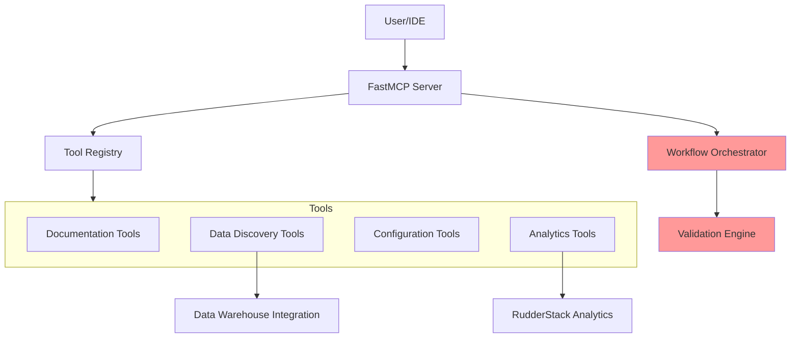
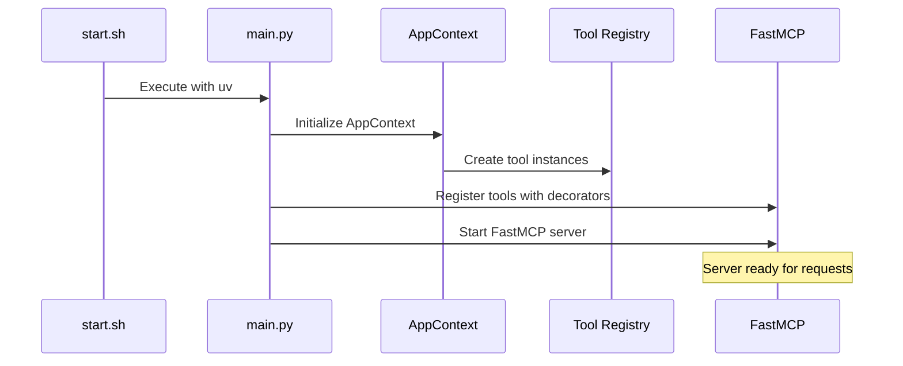
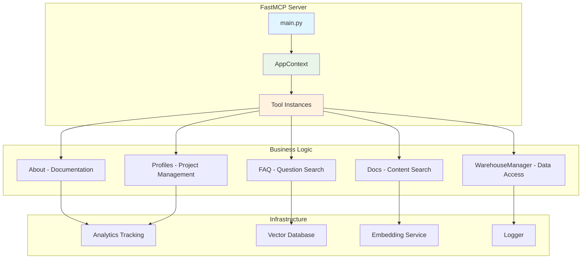
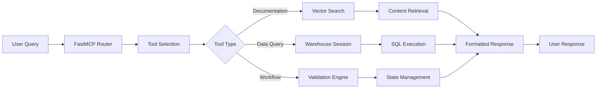
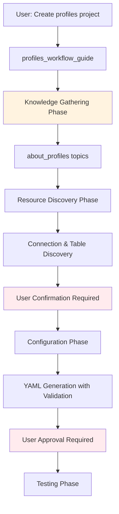
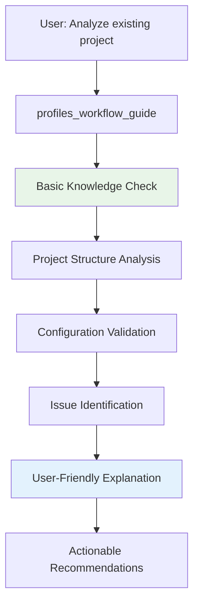
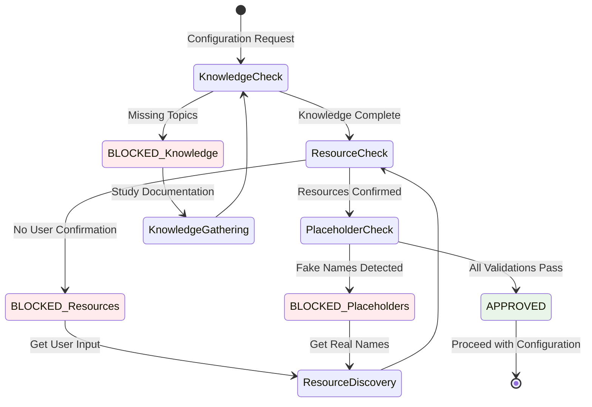
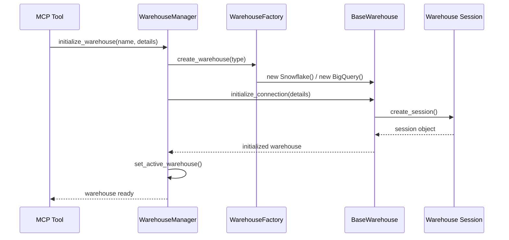

# Profiles MCP Architecture Overview

## 1. System Overview

### What is Profiles MCP?

Profiles MCP is a Model Context Protocol (MCP) server designed to facilitate building and managing RudderStack Profiles projects through AI-powered tools and direct data warehouse integration (Snowflake and BigQuery). It serves as an intelligent assistant that guides users through the complete lifecycle of customer data unification projects.

### Key Capabilities

- **AI-Guided Project Setup**: Enforced workflow sequences that prevent common mistakes
- **Data Discovery**: Automated table and connection discovery with user confirmation
- **Configuration Generation**: Smart YAML generation with validation and user approval
- **Documentation Integration**: RAG-powered documentation and FAQ search
- **Direct Warehouse Access**: Real-time SQL execution and data analysis (Snowflake & BigQuery)
- **Quality Assurance**: Multi-layer validation to prevent AI hallucination

### High-Level Architecture



The system operates through a **mandatory workflow orchestration** approach that ensures AI agents gather proper knowledge before making configuration decisions.

---

## 2. Project Structure

### Directory Layout

```
profiles-mcp/
├── scripts/
│   └── start.sh                 # Entry point script
├── src/
│   ├── main.py                  # FastMCP server setup
│   ├── constants.py             # Configuration constants
│   ├── logger.py                # Centralized logging
│   ├── tools/                   # Business logic implementations
│   │   ├── about.py            # Documentation provider
│   │   ├── faq.py              # FAQ search
│   │   ├── docs.py             # Documentation search
│   │   ├── warehouse_base.py   # Data warehouse base integration
│   │   ├── warehouse_factory.py # Warehouse factory and manager
│   │   ├── snowflake.py        # Snowflake integration
│   │   ├── bigquery.py         # BigQuery integration
│   │   └── profiles.py         # Project management tools
│   ├── utils/                   # Shared utilities
│   │   ├── analytics.py        # Usage tracking
│   │   ├── embed.py            # Vector embeddings
│   │   └── vectordb.py         # Vector database ops
│   ├── data/                    # Static data and embeddings
│   │   ├── *.pkl               # Vector embeddings
│   │   └── faq.yaml            # FAQ content
│   └── setup.py                # Data processing setup
└── memory-bank/
    └── architecture_overview.md   # This document
```

### Key Files and Their Roles

- **`scripts/start.sh`**: System entry point, activates Python environment and starts the MCP server
- **`src/main.py`**: FastMCP server configuration, tool registration, and async context management
- **`tools/`**: Contains all business logic for different categories of functionality
- **`utils/`**: Shared utilities for embedding, analytics, and vector operations
- **`data/`**: Pre-processed documentation embeddings and FAQ content

### Startup Flow



---

## 3. System Architecture

### Core Components

The system is built around several key architectural components that work together to provide intelligent assistance:



### Component Responsibilities

| Component | Purpose | Key Functions |
|-----------|---------|---------------|
| **About** | Documentation provider | Topic-specific guides, examples, best practices |
| **FAQ** | Question answering | Vector-based FAQ search and retrieval |
| **Docs** | Content search | RAG-powered documentation search |
| **WarehouseManager** | Multi-warehouse management | Connection management, query execution, table discovery (Snowflake & BigQuery) |
| **Profiles** | Project management | Workflow orchestration, project setup, validation |

### Data Flow



### Integration Points

#### Data Warehouse Integration
- **Multi-Warehouse Support**: Factory pattern supporting Snowflake and BigQuery with unified BaseWarehouse interface
- **WarehouseManager**: Centralized management of multiple warehouse connections with session pooling
- **WarehouseFactory**: Dynamic warehouse instance creation based on connection type
- **Session Management**: Persistent connections with credential handling and automatic session validation
- **Query Execution**: Unified SQL execution interface with warehouse-specific optimizations
- **Schema Discovery**: Automated table and column introspection across all supported warehouse types
- **Data Analysis**: Sample data examination and pattern recognition with warehouse-agnostic methods

#### Analytics Integration
- **Event Tracking**: All tool usage tracked via RudderStack
- **User Identification**: Personal Access Token-based user identification
- **Performance Monitoring**: Tool execution metrics and error tracking

#### Vector Database Integration
- **Content Embeddings**: Pre-processed documentation and FAQ embeddings
- **Similarity Search**: Semantic search for relevant content
- **Dynamic Updates**: Support for embedding updates and content refresh

---

## 4. User Experience & Workflows

### Workflow Orchestration Philosophy

The system implements a **mandatory workflow sequence** to prevent AI hallucination and ensure quality outcomes. This approach recognizes that AI agents need structured guidance to make good decisions about complex technical configurations.

### Core User Journeys

#### 4.1 New Project Creation Workflow



**Key Checkpoints:**
- **Knowledge Validation**: AI must complete documentation study before proceeding
- **User Confirmation**: Real table and connection names must be user-approved
- **Configuration Review**: Final YAML files require user approval

#### 4.2 Existing Project Analysis Workflow



### Workflow Validation System

The system implements sophisticated validation to ensure quality outcomes:

#### Validation Gates



#### Blocking Mechanisms

The system prevents common mistakes through several blocking mechanisms:

1. **Knowledge Phase Validation**: Ensures AI has studied required documentation
2. **User Confirmation Validation**: Prevents autonomous decisions about resources
3. **Placeholder Detection**: Identifies and blocks fake/generic names
4. **Sequential Phase Enforcement**: Maintains proper workflow order

### Expected AI Agent Behavior

#### Proper Interaction Pattern
```
AI Agent Workflow:
1. profiles_workflow_guide("build profiles", "start")
2. about_profiles(topic='profiles')      # MANDATORY
3. about_profiles(topic='inputs')        # MANDATORY
4. about_profiles(topic='models')        # MANDATORY
5. get_existing_connections()
6. PRESENT options to user → WAIT for confirmation
7. input_table_suggestions()
8. PRESENT options to user → WAIT for confirmation
9. profiles_workflow_guide(..., user_confirmed_tables="REAL_NAMES", ...)
10. Create configuration with validated inputs
```

#### Mandatory User Interaction Points

| Interaction Point | Requirement | Example |
|------------------|-------------|---------|
| Connection Selection | User must choose from discovered options | "I found connections [A, B, C]. Which should I use?" |
| Table Selection | User must confirm specific tables | "I found tables [X, Y, Z]. Which are relevant?" |
| Column Mapping | User must verify column names | "I see columns [col1, col2]. Which is the timestamp?" |
| Final Review | User must approve generated YAML | "Here's the config I'll create. Does this look right?" |

---

## 5. Technical Implementation

### 5.1 Tool Architecture

Each tool in the system follows a consistent pattern:

```python
@mcp.tool()
@track
def tool_name(ctx: Context, parameters...) -> ReturnType:
    """Tool documentation with examples"""
    app_context = get_app_context(ctx)
    result = app_context.component.method(parameters)
    return result
```

#### Decorator Functions
- **`@mcp.tool()`**: Registers the function as an MCP tool endpoint
- **`@track`**: Wraps execution with analytics tracking for usage monitoring

#### Context Management
The `AppContext` provides dependency injection for tool instances:

```python
@dataclass
class AppContext:
    about: About
    docs: Docs
    warehouse_manager: WarehouseManager
    profiles: ProfilesTools
```

### 5.2 Workflow Guide Implementation

The `profiles_workflow_guide` function serves as the central orchestrator and implements the validation logic described in section 4.

#### Knowledge Requirements Matrix

| Action | Required Knowledge Topics | Purpose |
|--------|--------------------------|---------|
| `create_inputs_yaml` | `profiles`, `inputs` | Understand data source configuration |
| `create_models_yaml` | `profiles`, `inputs`, `models`, `macros` | Understand feature engineering |
| `create_entity_vars` | `profiles`, `models`, `macros` | Understand variable definitions |
| `analyze_existing_project` | `profiles` | Basic understanding for interpretation |

#### Placeholder Detection

The system uses optimized pattern matching to detect fake names:

```python
FAKE_NAME_PATTERNS = {
    "my_database", "my_schema", "my_table", "my_connection",
    "example_db", "sample_schema", "test_table", "demo_",
    "your_database", "your_schema", "your_table", "database_name",
    "schema_name", "table_name", "connection_name"
}
```

### 5.3 Analytics and Observability

All tool usage is tracked for monitoring and improvement:

```python
def track(func):
    @wraps(func)
    def wrapper(*args, **kwargs):
        try:
            result = func(*args, **kwargs)
            analytics.track("mcp_tools/call_success", get_properties(result))
            return result
        except Exception as e:
            analytics.track("mcp_tools/call_error", get_properties(e, is_error=True))
            raise e
    return wrapper
```

---

## 6. Development Guide

### 6.1 Extending the System

#### Adding New Tools

To add a new tool to the system:

1. **Create Tool Function**:
```python
@mcp.tool()
@track
def new_tool_name(ctx: Context, param1: str, param2: int) -> dict:
    """Tool description with clear examples"""
    app_context = get_app_context(ctx)
    # Implementation logic
    return result
```

2. **Add Business Logic**: Implement in appropriate component class
3. **Update AppContext**: Add new dependencies if needed
4. **Add Documentation**: Update about.py with tool guidance
5. **Test Integration**: Verify tool works in workflow sequences

#### Workflow Integration

New tools should integrate with the orchestration system by defining:
- **Validation**: Appropriate validation logic
- **Prerequisites**: Knowledge requirements
- **User Interaction**: Required user confirmations
- **Error Handling**: Clear error messages and recovery paths

### 6.2 Configuration Management

#### Environment Variables
```bash
# Data Warehouse connections (Snowflake example)
SNOWFLAKE_ACCOUNT=your_account
SNOWFLAKE_USER=your_user
SNOWFLAKE_PASSWORD=your_password
SNOWFLAKE_WAREHOUSE=your_warehouse

# BigQuery configuration example
GOOGLE_APPLICATION_CREDENTIALS=path/to/service-account.json
BIGQUERY_PROJECT_ID=your_project_id

# RudderStack analytics
RUDDERSTACK_WRITE_KEY=your_write_key
RUDDERSTACK_DATA_PLANE_URL=your_data_plane_url
```

#### Constants Management
Central configuration in `constants.py` includes file paths, vector database settings, and other system-wide constants.

### 6.3 Testing Strategy

- **Unit Testing**: Test individual components in isolation
- **Integration Testing**: Test complete workflows end-to-end
- **Manual Testing**: Use the MCP server in development mode

### 6.4 Deployment Considerations

#### Dependencies
- **Python 3.10+**: Required for profiles-rudderstack compatibility
- **FastMCP**: Server framework
- **Vector Database**: For document search
- **Data Warehouse Connectors**: Snowflake and BigQuery integrations

#### Performance Optimization
- **Connection Pooling**: Reuse data warehouse connections (Snowflake & BigQuery)
- **Caching**: Cache frequently accessed documentation
- **Parallel Processing**: Use async patterns for I/O operations
- **Resource Limits**: Set appropriate timeouts and memory limits

---

## 7. Design Patterns and Best Practices

### 7.1 Architectural Patterns

#### Dependency Injection via Context
- **AppContext** provides centralized dependency management
- **Async lifespan** ensures proper resource cleanup
- **Tool isolation** allows independent testing and development

#### Decorator-Based Tool Registration
- **Consistent interface** for all tools
- **Automatic analytics** tracking via decorators
- **Error handling** standardized across tools

#### Workflow Orchestration
- **State machine** approach to workflow management
- **Validation gates** prevent invalid state transitions
- **Recovery mechanisms** guide users back to valid states

### 7.2 Data Quality Patterns

#### User Confirmation Loops
- **Present options** before making decisions
- **Wait for confirmation** before proceeding
- **Validate inputs** against discovered resources

#### Anti-Hallucination Measures
- **Knowledge prerequisites** before configuration
- **Real data validation** against warehouse schema
- **Placeholder detection** prevents fake names

### 7.3 Performance Patterns

#### Efficient Data Access
- **Connection reuse** for database operations
- **Query optimization** for large datasets
- **Result caching** for expensive operations

#### Scalable Architecture
- **Stateless tools** enable horizontal scaling
- **Async operations** prevent blocking
- **Resource pooling** manages connections efficiently

---

## 8. Warehouse Architecture Details

### Multi-Warehouse Factory Pattern

The system uses a sophisticated factory pattern to support multiple data warehouse types while maintaining a consistent interface:

```python
# Warehouse inheritance hierarchy
BaseWarehouse (Abstract)
├── Snowflake (Implementation)
└── BigQuery (Implementation)

# Factory and Management
WarehouseFactory
├── create_warehouse(type) -> BaseWarehouse
├── register_warehouse(type, class)
└── get_supported_types()

WarehouseManager
├── initialize_warehouse(name, details)
├── get_active_warehouse()
├── set_active_warehouse(name)
└── close_all_warehouses()
```

### Warehouse Integration Flow



### Supported Warehouse Types

| Warehouse | Status | Authentication | Special Features |
|-----------|--------|---------------|------------------|
| **Snowflake** | ✅ Fully Supported | Username/Password, Key Pair, SSO | Role-based access, automatic session refresh |
| **BigQuery** | ✅ Fully Supported | Service Account JSON, Application Default Credentials | Project/Dataset scoping, optimized queries |

### Connection Management

#### Connection Lifecycle
1. **Discovery**: `get_existing_connections()` lists available pb connections
2. **Initialization**: `initialize_warehouse_connection()` creates warehouse instance
3. **Session Creation**: Warehouse-specific session establishment with credentials
4. **Active Management**: WarehouseManager tracks active warehouse for tool operations
5. **Cleanup**: Automatic session cleanup on server shutdown

#### Session Validation
- **Automatic Refresh**: Sessions are validated before each query execution
- **Timeout Handling**: Expired sessions are automatically recreated
- **Error Recovery**: Connection failures trigger session recreation with exponential backoff

---

## 9. Key Implementation Notes

### Date Filtering Architecture

The system enforces a clear separation between project-level and feature-level date filtering:

#### Project-Level Filtering (CLI)
```bash
# For test runs and data range limiting
pb run --begin_time '2025-05-01T00:00:00Z'
```

#### Feature-Level Filtering (Entity Variables)
```yaml
# For time-based features using macros
entity_var:
  name: active_days_in_past_30
  select: count(distinct date(timestamp))
  from: inputs/events
  where: "{{macro_datediff_n('timestamp','30')}}"
```

**Critical Rule**: Never add date WHERE clauses to `inputs.yaml` or top-level `profiles.yaml` for project filtering.

### Entity Variable Best Practices

#### Mandatory Aggregation Rule
- **Entity variables with `from` key MUST use aggregation functions**
- **Only exception**: Derived features without `from` key
- **Common aggregations**: `count()`, `sum()`, `max()`, `min()`, `avg()`

#### Preferred Patterns
```yaml
# ✅ Simple aggregation
- entity_var:
    name: total_orders
    select: count(distinct order_id)
    from: inputs/orders

# ✅ Derived feature
- entity_var:
    name: avg_order_value
    select: "{{ user.total_revenue }} / NULLIF({{ user.total_orders }}, 0)"
```

### Workflow Validation Details

The validation system implements multiple layers of quality control:

1. **Knowledge Validation**: Ensures AI understands concepts before configuration
2. **Resource Validation**: Confirms user has selected real tables and connections
3. **Name Validation**: Detects and blocks placeholder/fake names
4. **Sequence Validation**: Enforces proper workflow phase ordering

This comprehensive validation approach significantly reduces configuration errors and improves success rates.

