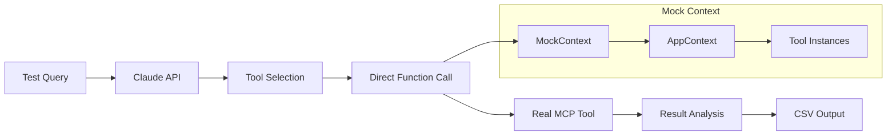
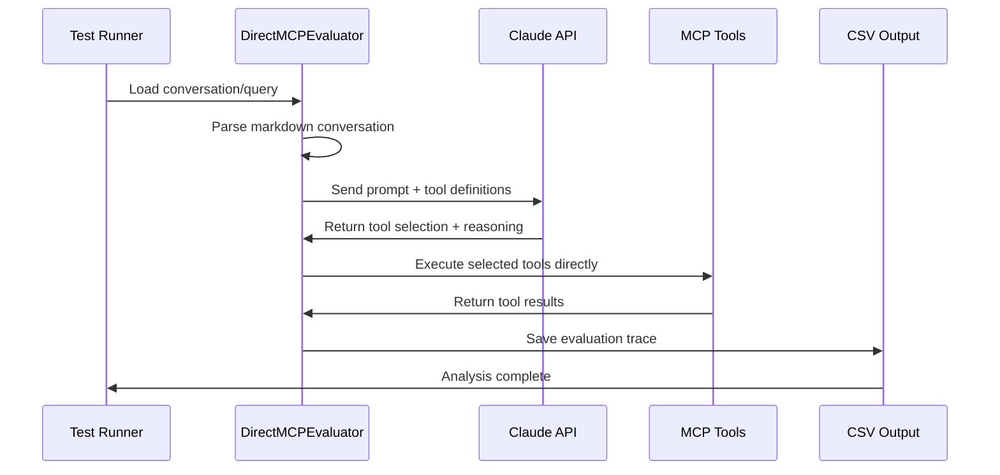

# MCP LLM Evaluation Framework

This document explains the LLM evaluation framework for testing how Claude Sonnet-4 interacts with RudderStack Profiles MCP server tools.

## Overview

The evaluation framework tests MCP tool selection from an LLM evaluation perspective using **direct function import** for reliable testing of real MCP tool behavior.

## Architecture: Direct Function Import



## Test Files Overview

### Core Evaluation Files

| File | Purpose | Status |
|------|---------|---------|
| `evaluator.py` | **Primary evaluation tool** - Direct function import approach | ✅ Active |
| `run_tests.py` | Test runner - orchestrates evaluation execution | ✅ Active |

### Supporting Files

| File | Purpose | Usage |
|------|---------|-------|
| `test_constants.py` | Constants (Claude model version) | Configuration |
| `prompts.py` | System prompts for different testing scenarios | Prompt templates |
| `__init__.py` | Python package marker | Infrastructure |

### Test Data & Configuration

| File | Purpose | Contents |
|------|---------|----------|
| `test_queries.csv` | Test cases with expected/forbidden tools | CSV test corpus |
| `sample_conv.md` | Real conversation for testing conversation history | Markdown conversation |
| `test_conv.md` | Additional conversation test case | Markdown conversation |

### Output Files (Generated)

| File | Purpose | Generated By |
|------|---------|-------------|
| `sample_conv_out.csv` | Conversation test results | mcp_eval_direct.py |
| `mcp_samples_conv_*.csv` | Historical test outputs | Various runs |

## Implementation: Direct Function Import

### Design Choice
We use direct function import instead of MCP server stdio connection due to connection complexity and reliability issues. This approach provides real tool execution without server overhead.

### Solution Architecture

```python
# Direct import of MCP tools as regular functions
from main import (
    about_profiles,
    get_existing_connections,
    search_profiles_docs,
    # ... all MCP tools
)

# Mock context to satisfy MCP tool requirements
@dataclass
class MockContext:
    request_context: MockRequestContext = None
    
    def __post_init__(self):
        app_context = AppContext(
            about=About(),
            docs=Docs(), 
            snowflake=Snowflake(),
            profiles=ProfilesTools()
        )
        self.request_context = MockRequestContext(lifespan_context=app_context)

# Execute tools directly
def execute_tool(tool_name: str, tool_params: Dict) -> Any:
    func = TOOL_FUNCTIONS[tool_name]
    result = func(self.ctx, **tool_params)
    return result
```

### Benefits
- ✅ **Real tool execution** - Actual MCP tool behavior, not mocked
- ✅ **No server overhead** - Direct function calls, no async/stdio complexity  
- ✅ **Reliable testing** - Bypasses connection issues
- ✅ **Fast execution** - No server startup time
- ✅ **Easy debugging** - Direct Python stack traces

## Evaluation Workflow



## Running Evaluations

### Primary Tool: evaluator.py

```bash
# Test with conversation history
python tests/evaluator.py -c tests/sample_conv.md -o results.json -i 3

# Test single query
python tests/evaluator.py -q "What connections are available?" -o results.json

# Test CSV suite of queries (like test_queries.csv)
python tests/evaluator.py --csv tests/test_queries.csv -o test_suite_results.json

# Multiple iterations for consistency testing
python tests/evaluator.py -q "Tell me about profiles" -i 10 -o results.json
```

### Via Test Runner

```bash
python tests/run_tests.py
```

## Requirements

### Environment Setup
- `ANTHROPIC_API_KEY` environment variable
- `RUDDERSTACK_PAT` for MCP tool authentication
- Python 3.10+ with required dependencies

### Dependencies
- `anthropic` - Claude API client
- `dotenv` - Environment variable loading
- Standard library: `csv`, `json`, `pathlib`, etc.

## Output Analysis

### JSON Output Format
```json
{
  "metadata": {
    "total_results": 3,
    "generated_at": "2025-07-31T16:30:33.099893",
    "model": "claude-4-sonnet-20250514",
    "conversation_file": "tests/sample_conv.md",
    "query": null,
    "iterations": 3
  },
  "results": [
    {
      "iteration": 1,
      "timestamp": "2025-07-31T16:30:33.099893",
      "model": "claude-4-sonnet-20250514",
      "prompt": "lets go with these features first.",
      "conversation_file": "tests/sample_conv.md",
      "tools_called": ["profiles_workflow_guide"],
      "tool_params": {"profiles_workflow_guide": {...}},
      "agent_reasoning": "Perfect! Let me create the models.yaml...",
      "tool_results": {"profiles_workflow_guide": "..."},
      "latency_ms": 5045.46,
      "token_count": 5710,
      "error": null
    }
  ]
}
```

### Key Metrics Captured
- **Model**: Exact LLM model used for each evaluation
- **Tool Selection**: Which tools Claude chose (as array)
- **Parameter Extraction**: How Claude interpreted tool parameters (as objects)
- **Reasoning**: Claude's complete explanation and response
- **Execution Results**: Actual tool output (full content, not truncated)
- **Performance**: Latency and token usage
- **Error Handling**: Any failures in execution

## Test Insights & Results

### Tool Selection Patterns
1. **profiles_workflow_guide dominance** - Claude prefers workflow guide for setup questions
2. **Smart parameter extraction** - Excellent at inferring topic parameters
3. **Context awareness** - Considers conversation history effectively
4. **Fallback behavior** - Graceful handling of ambiguous prompts

### Performance Characteristics
- **Average latency**: ~3-8 seconds per evaluation
- **Token efficiency**: 3-8K tokens per interaction
- **Success rate**: Varies by test type and complexity
- **Consistency**: High repeatability across iterations

## What This Framework Enables

### 1. **Real Tool Behavior Testing**
- Test actual MCP tool execution, not mocked behavior
- Validate tool parameter handling and edge cases
- Capture real performance characteristics

### 2. **Conversation History Testing**
- Load real conversations from markdown files
- Test how conversation context affects tool selection
- Validate multi-turn interaction patterns

### 3. **CSV Test Suite Validation**
- Run comprehensive test suites with expected/forbidden tools
- Validate tool selection against defined criteria
- Batch testing with automatic pass/fail validation

### 4. **Prompt Engineering Validation**
- Test tool description effectiveness
- Measure impact of description changes on selection
- Optimize tool boundaries and responsibilities

### 5. **Regression Testing**
- Ensure consistent tool selection across updates
- Catch unintended changes in tool behavior
- Validate new tool integration doesn't break existing patterns

This framework provides reliable testing of MCP tool selection and execution behavior with minimal complexity.

## File-by-File Usage Guide

### Core Evaluation Tools

#### `evaluator.py` ⭐ **Recommended**
**Purpose**: Primary evaluation tool using direct function import approach

**Usage**:
```bash
# Conversation testing
python tests/evaluator.py -c tests/sample_conv.md -o results.json -i 3

# Single query testing  
python tests/evaluator.py -q "What connections are available?" -o test.json

# CSV test suite with validation
python tests/evaluator.py --csv tests/test_queries.csv -o suite_results.json

# Multiple iterations for consistency
python tests/evaluator.py -q "Tell me about profiles" -i 10 -o consistency.json
```

**Key Features**:
- ✅ Real MCP tool execution
- ✅ Conversation history support
- ✅ CSV test suite support (with validation)
- ✅ Direct function calls (no server overhead)
- ✅ Comprehensive JSON output
- ✅ Mock context for tool requirements

#### `run_tests.py`
**Purpose**: Test runner that orchestrates evaluation execution

**Usage**:
```bash
python tests/run_tests.py
```

**What it does**: Runs the evaluation framework

### Support & Configuration Files

#### `test_constants.py`
**Purpose**: Configuration constants

**Contents**:
```python
SONNET_MODEL="claude-4-sonnet-20250514"
```

#### `prompts.py`
**Purpose**: System prompts for different testing scenarios

**Contents**:
- `CLAUDE_CODE_SYSTEM_PROMPT` - Default prompt matching Claude Code style
- `VERBOSE_SYSTEM_PROMPT` - Detailed, explanatory responses  
- `MINIMAL_SYSTEM_PROMPT` - Concise, direct responses
- `TOOL_SELECTION_PROMPT` - Focused on tool selection testing

**Usage**: Import desired prompt in evaluation code for different testing behaviors

#### `__init__.py`
**Purpose**: Makes tests directory a Python package (empty file)

### Test Data Files

#### `test_queries.csv`
**Purpose**: CSV corpus of test cases with expected/forbidden tools

**Format**:
```csv
test_name,user_prompt,expected_tools,forbidden_tools,description
profiles_basic,Tell me about RudderStack Profiles,about_profiles,,Basic profiles information request
connections,What connections are available?,get_existing_connections,about_profiles,Test specific over general tool selection
```

**CSV Columns:**
- `test_name`: Unique test identifier
- `user_prompt` (or `prompt`): The query to send to Claude
- `expected_tools`: Comma-separated tools that should be called (optional)
- `forbidden_tools`: Comma-separated tools that should NOT be called (optional)
- `description`: Human-readable test description

**Validation**: When using `--csv`, the framework automatically validates tool selection against expected/forbidden criteria and reports PASS/FAIL for each test.

#### `sample_conv.md`
**Purpose**: Real conversation exported from Claude/Cursor for testing conversation history

**Usage**: Used with `-c` flag in evaluation tools

**Format**: Markdown with **User** and **Assistant** headers

#### `test_conv.md`
**Purpose**: Additional conversation test case

**Usage**: Alternative conversation file for testing

### Output Files (Generated)

#### `results.json` / `sample_conv_out.json`
**Generated by**: evaluator.py with `-o` flag
**Contains**: Conversation or query evaluation results in JSON format

#### `mcp_samples_conv_*.csv`
**Generated by**: Historical test runs
**Contains**: Timestamped evaluation outputs

## Workflow Recommendations

### For New Development
```bash
# 1. Test single queries first
python tests/evaluator.py -q "Your test query" -o quick_test.json

# 2. Test with conversation context
python tests/evaluator.py -c tests/sample_conv.md -o conv_test.json

# 3. Run CSV test suite for validation
python tests/evaluator.py --csv tests/test_queries.csv -o validation.json

# 4. Run consistency checks
python tests/evaluator.py -q "Your test query" -i 10 -o consistency.json
```

### For Regression Testing
```bash
# Run the standard test suite
python tests/run_tests.py

# Or run CSV test suite directly
python tests/evaluator.py --csv tests/test_queries.csv -o regression_results.json
```

### For Custom Testing
```bash
# Create your own conversation file and test it
python tests/evaluator.py -c your_conversation.md -o results.json

# Test specific tool selection patterns
python tests/evaluator.py -q "Your specific prompt" -i 5 -o patterns.json
```

The **evaluator.py** is the recommended method for testing MCP tool behavior with minimal complexity.

## Advanced Testing: Custom System Prompts

### Available System Prompts

The framework includes multiple system prompts in `tests/prompts.py`:

| Prompt | Purpose | Use Case |
|--------|---------|----------|
| `CLAUDE_CODE_SYSTEM_PROMPT` | Default - matches Claude Code style | Standard evaluation, conversation testing |
| `VERBOSE_SYSTEM_PROMPT` | Detailed explanations and guidance | Testing comprehensive responses |
| `MINIMAL_SYSTEM_PROMPT` | Concise, direct responses | Testing minimal interaction patterns |
| `TOOL_SELECTION_PROMPT` | Focused on tool selection logic | Testing tool choice behavior specifically |

### Using Custom Prompts

To test different prompt behaviors, modify the `_get_system_prompt()` method in `evaluator.py`:

```python
def _get_system_prompt(self) -> str:
    """Get system prompt from prompts module"""
    from prompts import VERBOSE_SYSTEM_PROMPT  # Change this line
    return VERBOSE_SYSTEM_PROMPT
```

### Testing Prompt Variations

```bash
# Test the same query with different prompts by modifying prompts.py
python tests/evaluator.py -q "Tell me about profiles" -o claude_code_style.json
# (modify prompt in code)
python tests/evaluator.py -q "Tell me about profiles" -o verbose_style.json
# (compare results)
```

This enables testing how different prompt styles affect:
- Tool selection patterns
- Response verbosity
- Parameter extraction accuracy
- Multi-tool workflows